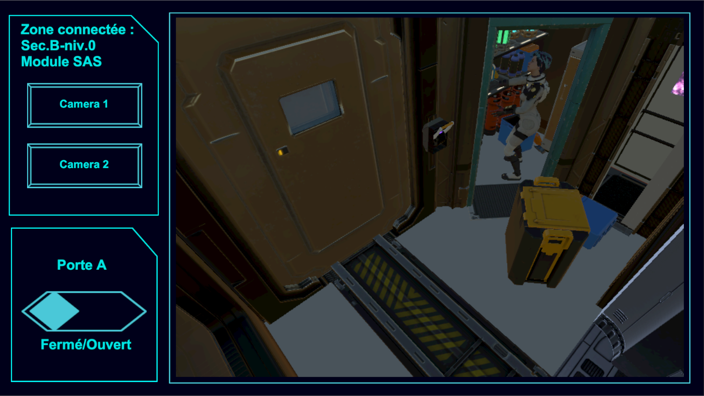
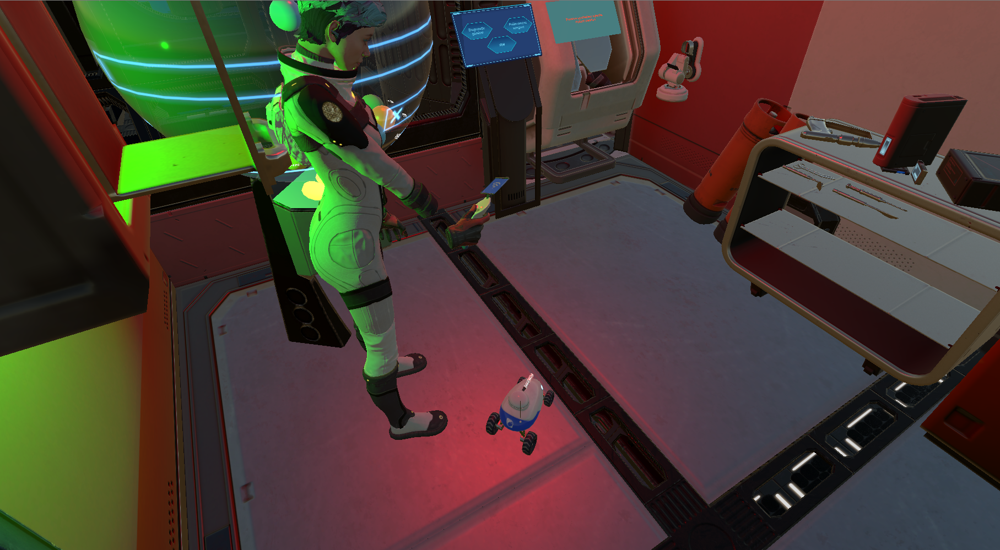
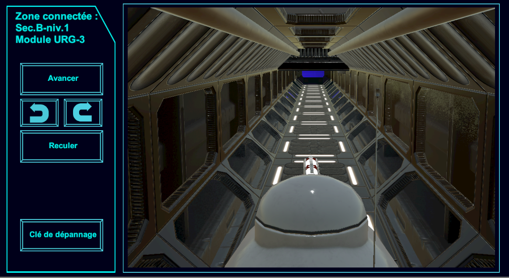

## Exile To Home (max 3 players | 1 VR player and 2 non VR player )

### Game Synopsis
The VR player will play the role of a space agent maintaining the station EXILE. An unknown spaceship has initiated an emergency docking on board and will require the player's attention. The emergency state has alerted a team on earth represented by the non VR players who will have to help the agent and only together can they manage the crisis.

### Gameplay Showcase

This Project is developped by the GameLab team members [Jeremy Ha](https://github.com/Jeremykaito) and [Marine Beurotte](https://github.com/mama98) and funded by the [Centre de Recherche Interdisciplinaire of Paris](https://cri-paris.org/en).

[Exile To Home V1](https://projects.cri-paris.org/projects/gTqYqiV1/des)